#Objective-C 程式設計學習筆記 Ch02
* Ch02 藉由 Xcode 來介紹第一支 Objective-C 。
* 本文已假設讀者已安裝 Xcode 環境。
* 本章所使用的 Xcode 版本為  Version 5.0.2。

在本節以及往後的範例，都會使用 Xcode 來解說以及編譯程式，另外除了 Xcode 之外，您也可以選擇使用終端機 (Terminal) 的 Clang 來編譯，在此並不介紹終端機的方式。

##(1) 建立專案
### A. 開啟 Xcode

* 點選 『Create a new Xcode Project』。

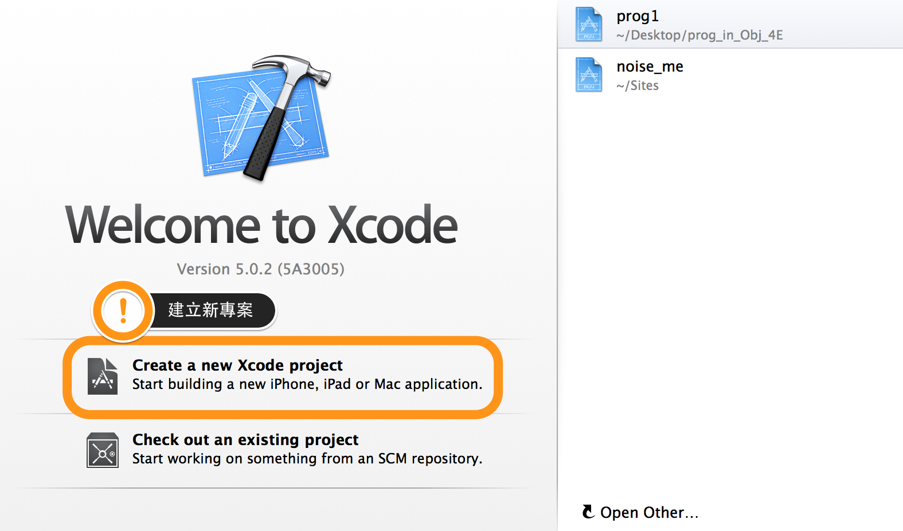


### B. 選擇 Project 類型為 Command Line Tool

* 為了方便練習使用，我們選擇左側 『OS X』 的子選單的 『Application』，並且選擇右側 Command Line Tool，接著點選 『Next』。

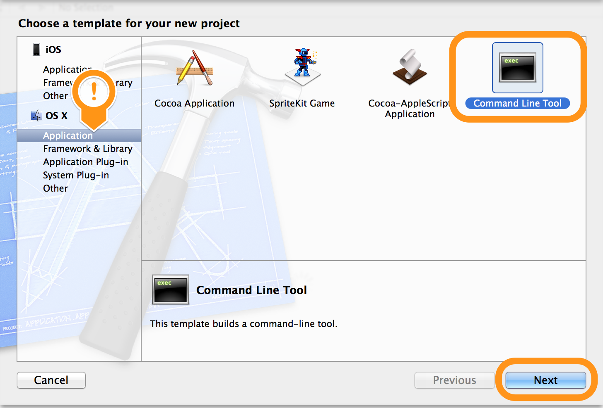

### C. 專案的基本設定

* 設定專案的名稱 (Product Name) (自己決定命名)。
* 設定專案的 Type 為 『Foundation』。

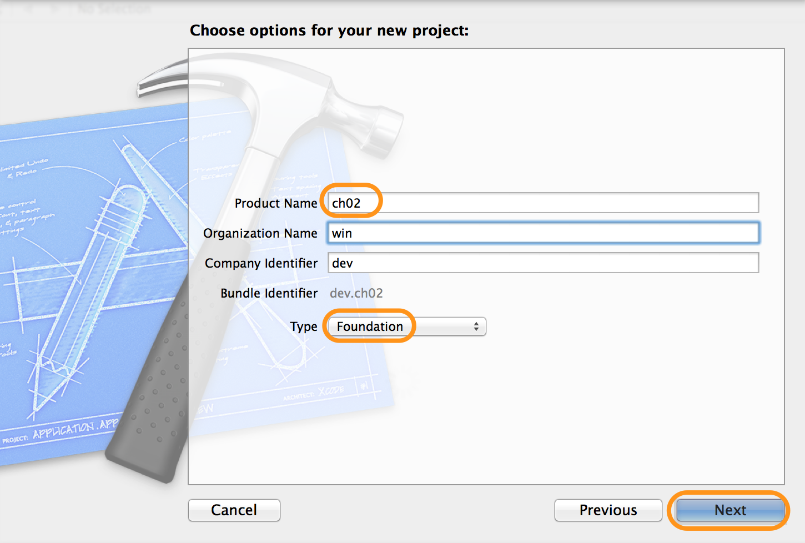

### D. 選擇專案的儲存路徑

* 你可以選擇現有的資料夾或是新建資料夾。
* 完成後可按 Next 進入初始畫面。

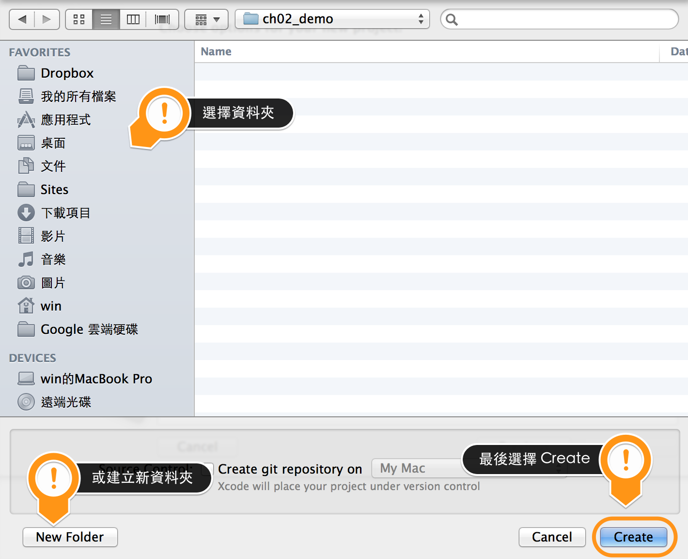

### E. 完成新增專案的步驟

* 到這個畫面時讀者不用擔心看到這麼複雜的畫面，這裡是一些關於專案的基本設定，我們先跳過這個步驟。下一段解說這個專案的程式碼。

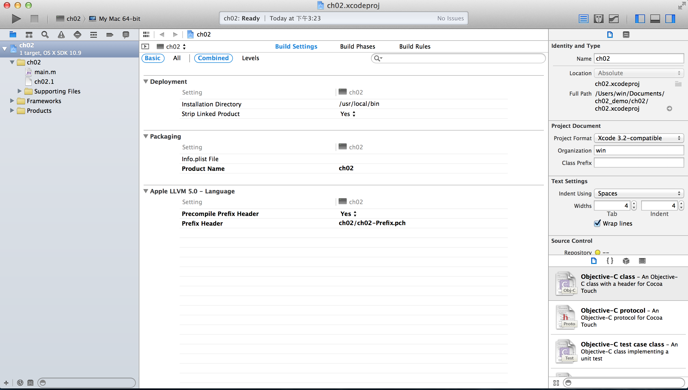


##(3) 開啟 main.m
### 開啟您專案資料夾的 main.m
* 請點擊左側資料夾裡面的 main.m，這邊的 main.m 是主要的程式的進入點。
	> 副檔名 .m 是 Objective-C 的附檔名。而 .h 是標頭檔名(header file)，在後面的章節，我們會討論到類別(Class)，而類別的定義檔通常也是 .h， 實作程式的部分附檔名為 .m。
* main.m 是 Xcode 自動幫你產生的檔案。


###main.m 的程式如下:

```
	//
	//  main.m
	//  ch02
	//
	//  Created by win on 2013/12/25.
	//  Copyright (c) 2013年 win. All rights reserved.
	//

	#import <Foundation/Foundation.h>

	int main(int argc, const char * argv[])
		{

	    @autoreleasepool {
        
        	// insert code here...
    	    NSLog(@"Hello, World!");
        
	    }
    	return 0;
	}

```

##(4) 語法解說
### 註解 (Comment) 格式：

```
//我不會被執行
```
在 main.m 你會看到行頭以 `//` 的句子，當程式在執行時，遇到 `//` 則會將該行視為註解，也就是說以 `//` 起始的句子，不會被執行。若有學過其他的程式語言，也幾乎就有這樣的註解方式。

而另一種註解方式為 `/* 被註解的內容 */` ，以 `/*` 以及 `*/` 包覆一段內容的頭尾，這種稱為多行註解。需要注意的事情是多行*註解不能被巢狀*。

* 多行註解：

	```
 	/*
	  main.m
	  ch02
	  Created by win on 2013/12/25.
  	  Copyright (c) 2013年 win. All rights reserved.
	*/
	```

* 註解不能被巢狀	

	```
	/*
		/* 這樣的註解會失敗 */
	*/
	```


### 使用 #import

```
#import <Foundation/Foundation.h>
```


* 若扣掉不會被執行的幾行註解，main.m 真正會被執行的第一行程式為 #import  <Foundation/Foundation.h>，其意思為載入 Foundation 資料夾裡面的 Foundation.h 的檔案，.h 的附檔名是屬於一種類別的定義檔。而 Foundation 是系統幫你產生的，你可以展開 Foundation 資料夾查看裡面放了多少檔案。
	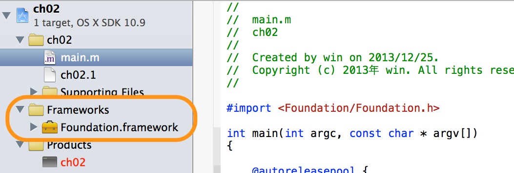
* 之所以需要匯入 Foundation.h 是因為後面的程式會用到 Foundation.h 的類別與函式。

### main 函式

```
int main(int argc, const char * argv[]){
	//code here
}
```

* main 函式前面的 int 代表的是這個函式的型別，而 int 這個型別代表整數，因此在 main 函數要結束時，會回傳一個整數，在這個範例中是 return 0。
* 而 ( ) 括弧裡面的內容，代表的是參數，這個容許我到後面章節再解釋，以這個例子來說，總共有兩個參數，一個是型別為 int 的 argc，以及型別為 const 的 argv。 
* 而要執行的程式內容寫在 { } 大括號裡面。
* 因此現在我們已知，宣告了一個 main 函式，並且將需要執行的程式寫在 { } 大括號中，在 main 執行程式內容的最後我們回傳了整數 0 (return 0)，代表程式正常執行，若回傳的值為非0，則表示程式可能有問題。

### autoreleasepool 自動釋放池

```
@autoreleasepool {
	//...
}
```
* 我們在 main.m 的 main 函數裡面會看到 @autoreleasepool，{ } 大括弧裡面是 autoreleasepool 會執行的程式部分，而 autorelease pool 稱為『自動釋放池』，用意在於讓系統有效管理這些程式的記憶體，這是一種管理記憶體的機制，在往後的章節會再遇到。


### NSLog 輸出函式

```
 NSLog(@"Hello, World!");
```

* 寫在 @autoreleasepool 裡面的內容為一個 NSLog 的函式，NSLog 是 Objective-C 的函式，可以用來輸出你所輸入的參數(引數)，並且會把當下的時間以及一些訊息顯示出來。
* 這些函式的敘述都必須以 `;` 結尾。
* 而在 "Hello, world!" 前面的 ＠ 主要是為了把後面的字串 (Hello, World!) 轉換為 NSString 的形態。
1. 如果字串前沒有 ＠，其形態為 C 語言形式的字串(C-Strings)，若加上了 ＠，則會轉換成 NSString 的形態。
2. C-String 可以轉換成 NSString，而 NSString 也可以轉換成 C-String。
3. 為什麼需要把  C 語言形式的字串(C-Strings) 轉換成 NSString? 原始的 C 語言是把字串拆成好幾的字元 (char) 儲存起來，而 NSString 是用 Unichar 組成，NSString 封裝了很多字串使用上的優勢，像是支援统一字符編碼, 使用的位元數更廣。


#### 讓我們加上一行 NSLog:
* 請在 NSLog(@"Hello, World!"); 後面加上一行 NSLog(@"Learning Objective-C");


## (4) 編譯與執行
* Xcode 的畫面主要有三個區塊：
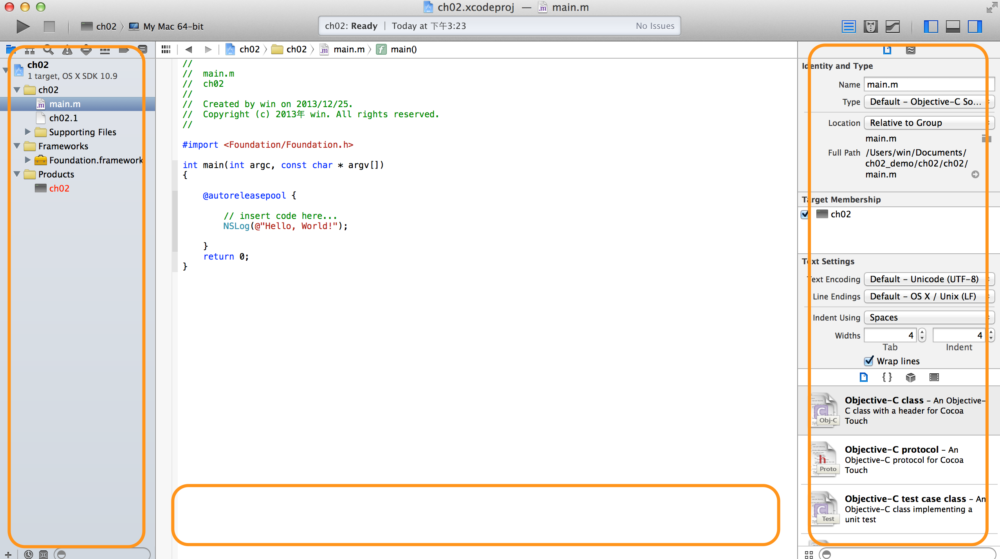

* 你可透過右上角的 icon，控制是否要顯示/隱藏哪些區塊：
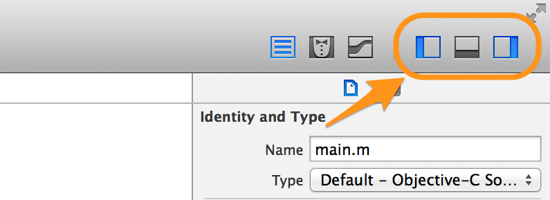

* 其編譯的結果通常會顯示在中間下方，請將中間下方的區塊顯示：
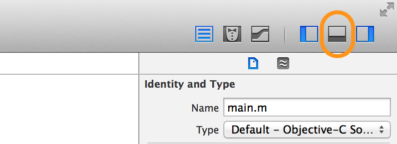

* 執行編譯與執行的動作，請按下左上角 『Run』按鈕，來進行編譯。
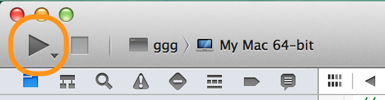

* 接著你會在畫面的下方看到編譯的結果：
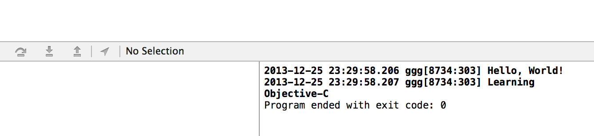


##(5) 深入的說
### 關於換行
* 通常我們不太可能為了顯示每一行字而一直使用 NSLog，因此你可以在 NSLog 裡面寫_換行符號_。
* 換行符號的寫法是 `\n`。
* 範例：
	`NSLog(@"Hello, World!\nMy Name\nwin\n 。");` 
* 執行結果：
    
    ```
     Hello, World! 
	 My Name
	 win 
 	  。
 	 ```

###NSLog 
* NSLog 不但可以處理一般字串輸出，還可以帶入變數或是一組需要計算的值作為參數。

* 範例1: 

	```
	NSLog(@"My Age is %i", 24);
	```
	
	* NSLog 有兩個參數，第一個是輸出的字串，第二個是值會被帶入字串的變數，在這個範例中，帶入的不是變數，而是直接帶入一個值，而這個值會被帶入字串裡面的 %i ，所以輸出結果為 『My Age is 24』，只要在 NSLog 的字串中看到 `%` 開頭，英文字接在後面的，都是會被後面的參數所替換。嚴格來說，NSLog 的第一個參數，應該叫做 『字串格式』，而字串格式可以依照後面所帶入的參數（變數），依序將該值取代掉字串的 `%?`。

* 範例2: 帶入多個參數(變數)

	```
	 int weight = 32;
	 int height = 140;
	 NSLog(@"My weight is %i and my height is %i", weight, height)
	```
	
	* 其執行結果為顯示 『 My weight is 32 and my height is 140』。

* `%` 後面所接字母，視要代入的變數的型別而有所不同，之後的章節我們會介紹各種變數型別，在上面的例子，因為 weight 以及 height 都是 int 的型別，因此在 NSLog 的字串格式，也必須使用 int 的型別 (%i) 來表示。 
* NSLog 並不是唯一的一種輸出函式，你也可以使用原始 C 語言的 printf( ) 輸出函式。


---

##參考資料
* [維基百科](http://zh.wikipedia.org/wiki/Objective-C)
* [精通 Objective-C 程式設計 (第五版)](http://www.books.com.tw/products/0010574124)
* [Programming with Objective-C](https://developer.apple.com/library/mac/documentation/cocoa/conceptual/ProgrammingWithObjectiveC/Introduction/Introduction.html#//apple_ref/doc/uid/TP40011210-CH1-SW1)
* [關於 NSString 的二三事](http://furnacedigital.blogspot.tw/2011/04/nsstring.html)

---

<a rel="license" href="http://creativecommons.org/licenses/by-nc-sa/4.0/"></a><br />本著作由<span xmlns:cc="http://creativecommons.org/ns#" property="cc:attributionName">WinWu</span>製作，以<a rel="license" href="http://creativecommons.org/licenses/by-nc-sa/4.0/">創用CC 姓名標示-非商業性-相同方式分享 4.0 國際 授權條款</a>釋出。