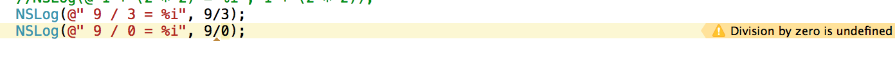
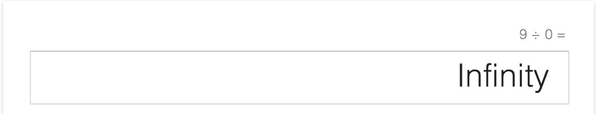

#Objective-C 程式設計學習筆記 Ch04

* Ch04-介紹 Objective-C 的運算式以及一些運算子。
* 本章會介紹的運算式就是基本的四則運算，也就是加『+』,減『-』,乘『*』,除『/』的四種組合，另外也會提到模數運算子(Modules Operator)『%』(講白話一點 %  就是取得餘數)。
* 關於運算子在這個章節僅會介紹部分，有些運算子會在後面的章節，依照主題的相關性會順便介紹。


##目錄:
* (1) 指定運算子
* (2) 加減乘除的順序 (優先權)
* (3) 單元負號運算子
* (4) 模數運算子(%)
* (5) 型別轉換運算子


##(1) 指定運算子
若要說到運算子，最基本的大概就是指定運算子(Assignment operator)了，在我們學習怎麼宣告一個變數時，就已經學會指定運算子了，`int a = 1;`，就是將 = 等號右邊的值，指定給 a 這個變數。


指定運算子也可以跟一般算術運算子結合使用，比方說 `int a = 1+1;` 是合法的指定值的方式。
指定運算子除了跟基本的 +, - , *, /, % 結合，其變數的值也可以使用位移的方式表達，比方說 `a = a + 1` 相當於 `a++` 也相當於 `a+=1`，而這種寫法，會在下一章節，迴圈的部分會很常遇到，務必熟悉。

範例:

```
int a = 1+1;

int b =1;
b+=1;
        
int c= 1;
c++;
        
NSLog(@"a is %i", a);
NSLog(@"b is %i", b);
NSLog(@"c is %i", c);
```

其結果都為 2: 

```
2013-12-28 ~[16887:303] a is 2
2013-12-28 ~[16887:303] b is 2
2013-12-28 ~[16887:303] c is 2
```


##(2) 加減乘除的順序 (優先權)
* 在我們小時候就已經學過了，所謂的『先乘除，後加減』，其實這就一種算式的優先權。以下是幾個關於加減乘除的運算優先權的整理：

| 優先程度 | 符號 | 
|:----|:------| 
| 高度優先 | -(負號) | 
| 中度優先 | *(乘), /(除), %(餘) |
| 低度優先  | +(加), -(減)| 


	1.『*』, 『/』, 『%』優先於『+』, 『-』
	2. 可以運用 ( ) 更清楚的表達運算的順序，若 ( ) 有巢狀，
	   則是越內部的 ( ) 先執行運算。(簡而言之就是 () 可以影響優先順序) 
	3. 如果整行運算式都同樣的優先權，是由左至右計算。


###範例 1: 簡單的比較
	
```
NSLog(@"1 + 2 * 2 = %i", 1 + 2 * 2);
NSLog(@"(1 + 2) * 2 = %i", (1 + 2) * 2);
NSLog(@"1 + (2 * 2) = %i", 1 + (2 * 2));
```

執行結果: 
 
```
2013-12-28 ~[16247:303] 1 + 2 * 2 = 5
2013-12-28 ~[16247:303] (1 + 2) * 2 = 6
2013-12-28 ~[16247:303] 1 + (2 * 2) = 5
```	
	
   * 第一行運算子跟第三行是一樣的意思，即便第一行的 2\*2 沒有被 ( ) 包覆，但因為是先乘除後加減，因此也是先運算 2\*2，然後再加上前面的 1， 最後得 5。
   
   * 第二行運算子，則是先運算 ( ) 內的結果，(1+2) 得 3 之後再 \* 2，因此會得 6 。 
    
---    
  
### 範例 2: 除數可以是 0 嗎？

```
NSLog(@" 9 / 3 = %i", 9/3);
NSLog(@" 9 / 0 = %i", 9/0);
```

執行結果:

```
2013-12-28 ~[16290:303]  9 / 3 = 3
2013-12-28 ~[16290:303]  9 / 0 = 8400912
```

* 第一行運算式， 9/3 得 3 沒有問題，但是第二行運算式，卻有一點狀況，一般我們如果在計算機按下 9/0 會得到不正確的結果，這是正常的，因為在程式語言中，把除數指定為 0，都會是不正常的結果或是錯誤，因此我們在後面的章節會學到，當除數為 0 的時候，則顯示錯誤或是一些提示訊息，而不要顯示不正常的結果。

* 在 Xcode 將除數設定為0時的警告:


* 使用 google 計算機將除數設定為0時的警告:


---

### 範例 3: 小心型別呀！

```
int a = 5;
int b = 2;
NSLog(@"a / b = %i", a/b);
```

執行結果:

```
2013-12-28 ~[16447:303] a / b = 2
```


* 以這個例子來說，大家或許會納悶，5 / 2 不是 2.5 嗎？ 要注意的是，我們在 NSLog 的輸出格式字串是 %i ， %i 是用來輸出整數的，因此計算的結果會是整數。
* 但是呢，或想要取得 2.5 這種浮點數格式的結果，千千萬萬不能直接使用 `NSLog(@"a / b = %f", a/b);`，在這裡我們不能直接將 %i 替換成 %f ，這是行不通的，因為變數 a 跟 b 本身的型別都是 int，你必須將 int 的型別轉成 float，才有辦法輸出成小數點的格式。

	```
	int a = 5;
    int b = 2;
    float  f1, f2;
    f1 = a;
    f2 = b;
    NSLog(@"a / b = %f", f1/f2);
	``` 
	結果:
	
	```
	2013-12-28 ~[16509:303] a / b = 2.500000
	```
	
	或是將其中一個 int 轉換成 float 也可以，以下是將 a 轉換成 float:
	
	```
	int a = 5;
    int b = 2;
    float  f1;
    f1 = a;
    NSLog(@"a / b = %f", f1/b);	
    ```
---

* 將整數指定給浮點數的型別，是可以正確的轉換。
* 如果將浮點數轉換給整數，則小數點的部分將會被捨去。
* 上面轉型別的範例，其實是將 int 的變數指定給一個 float 型別的變數，這只是一種型別轉換的方式，後面會在介紹如何轉換型別。


##(3) 單元負號運算子

* 單元負號運算子(unady minus operator)，就是將某個變數給予 - 號，使其變成負數。

* 以下的例子即是將 5 變成 -5。
	
	```
	int a = 5;
	NSLog(@"-a = %i", -a);
	```

* 要注意的事情是，單元負號運算子，只是在運算過程中將某變數轉換成負數，使其達到預期的計算結果，_並不是永久轉換_。
	
##(4) 模數運算子(%)
* 模數運算子的運算結果會是取得兩個數字相除之後的餘數。
	
	```
	NSLog(@"3 %% 2 = %i", 3%2);
	```
 	3 / 2 = 1 ...1，餘樹為 1。所以得到的結果為:
	
	```
	2013-12-28 ~[16618:303] 3 % 2 = 1
	```
    在 NSLog 的輸出字串格式中，必須使用 %% 代表 一個 % 符號。因為之前有提到輸出字串格式會依照 % 之後的字元，決定要輸出什麼樣的值，因此若要輸出一個 % ，就是要再帶上一個 %。
		


##(5) 型別轉換運算子
* 我們可以利用 ( ) 小括號，將一個變數做型別的轉換。
* 小括號 ( ) 裡面要寫的是要被轉換的型別，比方說 (float) 或是 (int)，這就是『型別轉換運算子』。
* 要注意的事情是，型別轉換運算子，只是在運算過程中將某變數轉換型別，使其達到預期的計算結果，_並不是永久轉換_。
* 型別轉換運算子的優先權大於一般的算術運算子，但與負號運算子相同優先權。
* 以下範例是將浮點數轉成整數:
	
	```
	NSLog(@"Result is %i", (int)2.5 + (int)2.5);
	```
	
	結果為:
	
	```
	2013-12-28 ~[16702:303] Result is 4
	```

* 以下範例是直接將計算結果轉換成 float:

	```
	NSLog(@"Result is %f", (float)10/3);
	```
	
	結果為:
	
	```
	2013-12-28 ~[16775:303] Result is 3.333333
	```


---

#### 下一章節，將會介紹 Objective-C 迴圈 。


##參考資料
* [精通 Objective-C 程式設計 (第五版)](http://www.books.com.tw/products/0010574124)
* [Programming with Objective-C](https://developer.apple.com/library/mac/documentation/cocoa/conceptual/ProgrammingWithObjectiveC/Introduction/Introduction.html#//apple_ref/doc/uid/TP40011210-CH1-SW1)

---

<a rel="license" href="http://creativecommons.org/licenses/by-nc-sa/4.0/"></a><br />本著作由<span xmlns:cc="http://creativecommons.org/ns#" property="cc:attributionName">WinWu</span>製作，以<a rel="license" href="http://creativecommons.org/licenses/by-nc-sa/4.0/">創用CC 姓名標示-非商業性-相同方式分享 4.0 國際 授權條款</a>釋出。