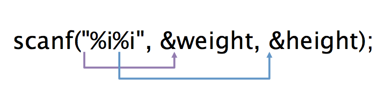

#Objective-C 程式設計學習筆記 Ch06

* Ch06-介紹 Objective-C 的流程控制。
* 本章會介紹 if, switch 以及 三元運算子。


##目錄:
* (1) if 敘述
* (2) switch 敘述
* (3) 三元運算子

if 敘述我們在上一章節已有稍微介紹，在這章節會介紹得更深入一點點...。


##(1) if 敘述
if 敘述用來根據判斷的條件，判斷執行哪一段程式。以口語化的表達方式舉例『如果消費滿 100元，就可以打 9 折』，則其 if 的敘述大概會像這樣:

```
if( spent >= 100)
	spent = spent * 0.9
```

###if敘述的描述方式 :

```
if(條件式){
  如果條件式為 TRUE，就執行此程式
}
```

假如你的程式區塊只有一行，那麼可以省略 { } 大括弧。

```
if(條件式)
  如果條件式為 TRUE，就執行此程式
```

###if...else 敘述 :
if...else 會是二擇一的選擇，其敘述方式如下:

```
if(條件式){
  如果條件式為 TRUE，就執行此程式
}else{
  如果條件式為 FALSE，就執行此程式	
}
```

一樣的，如果你的程式區塊也是都只有一行，則能省略 {  } 大括弧。

假如要判斷客戶是否為會員，如果是則總金額打 8 折，如果不是只能打 9 折:

```
if(user == member){
  spent = spent * 0.8
}else{
  spent = spent * 0.9
}
```

### 大於兩種以上的條件判斷 if...else if...else
當你需要判斷執行的條件大於 2 種以上時，你可以使用 if...else if...else，其敘述如下:

```
if(條件判斷1){
	如果條件判斷1為 TRUE 時，則執行此區塊的程式
}else if(條件判斷2){
   	當條件判斷1不成立時，則會進入到條件判斷2，若條件判斷2為 TRUE 時，則執行此區塊的程式
}else{
    當條件判斷1與2皆不成立時，則執行此區塊的程式
}
```


### if 敘述可以巢狀

```
if(條件式){
  	if(條件式){
  		如果條件式為 TRUE，就執行此程式
	}else{
  		如果條件式為 FALSE，就執行此程式	
	}
}
```

#### 小練習 1:
之前的章節我們有提到，除數不可為 0，比方說 9/0 是不合法的，因為除數不可為 0。接下來我們來寫一個 if else 的敘述，讓使用者輸入分子跟分母，判斷分母的數字不可為 0，若為 0 則顯示相關錯誤訊息。( 分子的英文是 Numerator, 分母的英文是 denominator)。

```
int numerator;
int denominator;
int result;
        
numerator = denominator = 0;
        
NSLog(@"Please Enter Your Numerator");
scanf("%i", &numerator);
NSLog(@"Please Enter Your Denominator");
scanf("%i", &denominator);
        
if(denominator<=0){
	NSLog(@"Error, Denominator can't <= 0");
}else{
	result = numerator/denominator;
	NSLog(@"%i / %i =   %i", numerator, denominator, result);
}
```

我們來測試看看 30/10 的 NSLog 結果:
(為了排版效果我有自己做一些斷行...實際上輸出不會排的這麼剛好)

```
2014-01-02 20:48:59.236 FractionTest[33634:303] 
Please Enter Your Numerator
30
2014-01-02 20:49:04.669 FractionTest[33634:303] 
Please Enter Your Denominator
10
2014-01-02 20:49:06.150 FractionTest[33634:303]
30 / 10 =   3
Program ended with exit code: 0
```

接著我們再來測試指定 0 給 Denominator，驗證是否會進入到 if(denominator<=0) 的程式區塊:

```
2014-01-02 20:53:32.120 FractionTest[33658:303]
Please Enter Your Numerator
30
2014-01-02 20:53:33.700 FractionTest[33658:303]
Please Enter Your Denominator
0
2014-01-02 20:53:34.637 FractionTest[33658:303]
Error, Denominator can't <= 0
Program ended with exit code: 0
```

---

#### 介紹 scanf( )輸入函式
在上面的範例我們使用到了 scanf 這個輸入函式，也就是你透過鍵盤，輸入值給電腦(上面的例子是使用 scanf 讓你分別輸入 Numerator 以及 Denominator 的值 )，並且可以將輸入的值存到某個變數的記憶體空間。 scanf 的表達方式為 :

```
scanf(“格式化輸入內容”, &參數1, &參數2, ...&參數n);
```

* 其『格式化輸入內容』，通常僅含相對應的參數的列印格式：$i, %d, %c, %f ... 等。
* 『&參數』代表著對應格式的變數記憶體位置。

比方說，我們宣告兩個變數，分別是身高跟體重，其值必須讓使用者自己輸入:

```
int weight;
int height;
NSLog(@"Please enter weight and height");
scanf("%i%i", &weight, &height);
NSLog(@"weight is %i, height is %i",weight, height);
```


其第一個輸入的數字就會儲存到 weight 變數的記憶體位置(&weight)，而第二次輸入的數字會儲存到 height 的記憶體位置(&height)，兩個變數的輸入格式都是 %i。

---

#### 介紹 BOOL 布林形態
* 在 Objective-C 中， bool 形態的值的表示方式，不是 true 就是 false，不是 Yes 就是 No，常常會以數字表示， 0 表示 false， 1 表示 true。在 if 的判斷敘述中，之前提到只要 if 的條件式為 TRUE，即代表滿足條件。因此當條件式的結果不為 0(false)，都會被當成是滿足條件。

有些時候你可能會遇到 if 的條件式沒有關係運算子(>=, >, < ...)，這是正常的現象，因為條件式只要非 0 ，都會被當成 true。

##### 例子1:
猜猜看這段程式哪一個 if 敘述會被執行:

```
int test_1 = 0;
int test_2 = 1;
if(test_1){
	NSLog(@"test_1 is true");
}
if(test_2){
	NSLog(@"test_2 is true");
}
```
答案是第二個，因為 test_2 的值為 1，1 所代表的 bool 形態是 true，因此以滿足執行條件。

##### 例子2:
例子2 我們直接宣告一個 Bool 形態的變數 isHot，以及整數形態的度數。
if 敘述用來判斷 degree 是否超過 32 度，若超過則 isHot 為 Yes，否則為 No。最後再判斷 isHot 的布林值，若布林值為 1 或 Yes 或 TRUE 則都等於成立(非 0 即成立)。你也可以試試看把 isHot =  Yes 或 NO 替換成 TRUE 或 FALSE 或是 1 或 0 其結果都相同。

```
BOOL isHot;
int degree = 36;
if(degree >=32){
	isHot = YES;
}else{
	isHot = NO;
}

if(isHot){
	NSLog(@"Weather is hot!");
}
```


##(2) switch 敘述
switch 敘述類似 if...else if...else，其敘述語法如下:

```
switch(條件式 expression){
	case "1":
		如果條件式結果是 1，則執行此區塊程式碼。
		break;
	case "2":
		如果條件式結果是 2，則執行此區塊程式碼。
		break;
	case "3":
	case "4":
		如果條件式結果是 3 或 4，則執行此區塊程式碼。
		break;
	default:
	如果上述的條件都沒有符合，則執行此區塊程式碼。
}
```

* 當條件式滿足 1 時，就會進入到 case "1" 的程式敘述裡面，若條件式不為 1，則往後面的 case 繼續尋找，直到尋到符合 case 值的條件式，假如都沒有找到符合的 case，則會進入到 default，default 是一種特別的 case，當沒有 case 的值滿足條件式的值時才會執行 default 的程式，。
* 每個 case 後面一定要加 break 敘述，否則程式就不會中斷，會一直往下執行 (default 可有可無)，break 是用來立即離開 switch 敘述，比方說當條件式等於 1 時，就已經滿足 case "1"，執行 case "1" 內的程式，遇到 break 之後就不會再往後面的 case 執行。

* 可以多個 case 共用一樣的程式敘述，比方說 

	```
	case "3":
	case "4":
		如果條件式結果是 3 或 4，則執行此區塊程式碼。
		break;
	```
  就是條件式滿足3 或是 滿足4 都會執行一樣的程式。 
	

##(3) 三元運算子
三元運算子其實也是 if...else，只是其敘述的方式比較特別，敘述方式為:

```
條件式 ? 程式敘述1 : 程式敘述2
```

三元運算子的執行判斷為: 如果條件式等於 TRUE，則執行程式敘述1，否則就執行程式敘述2。
其實這種表達方式就跟下面這段 if...else 相同。 

```
if(條件式){
	程式敘述1;
}else{
	程式敘述2;
}
```


###例子1:
用來判斷數學成績是否及格，顯示不同的 NSLog 字串:

```
int math_score = 57;
math_score < 60 ? NSLog(@"you fail") : NSLog(@"you pass!");
```
假如成績低於 60 分，則會顯示 you fail 字串，反之若是及格，則會顯示 you pass!。

更浮雜一點的，可以做到巢狀的判斷。假如數學成績超過 60 分，則會進入另一個三元運算子，也就是另一段 if...else 的判斷，假如成績又大於 90，則顯示 Excellent!，低於 90 則顯示 you pass!。

```
int math_score = 99;
math_score < 60 ? NSLog(@"you fail") : 
     ( math_score>90 ? NSLog(@"Excellent!") : NSLog(@"you pass!") );
```

###例子2:
這個例子用來比較兩個數值誰比較大，較大的值則會指派給變數 max_value:

```
int value_a = 20;
int value_b = 40;
        
int max_value = value_a >= value_b ? value_a: value_b;
NSLog(@"max_value is %i", max_value);
```


---

#### 下一章節，將會介紹 Objective-C 類別 。
從類別開始，將會進入物件導向的程式基礎。


---

<a rel="license" href="http://creativecommons.org/licenses/by-nc-sa/4.0/"></a><br />本著作由<span xmlns:cc="http://creativecommons.org/ns#" property="cc:attributionName">WinWu</span>製作，以<a rel="license" href="http://creativecommons.org/licenses/by-nc-sa/4.0/">創用CC 姓名標示-非商業性-相同方式分享 4.0 國際 授權條款</a>釋出。