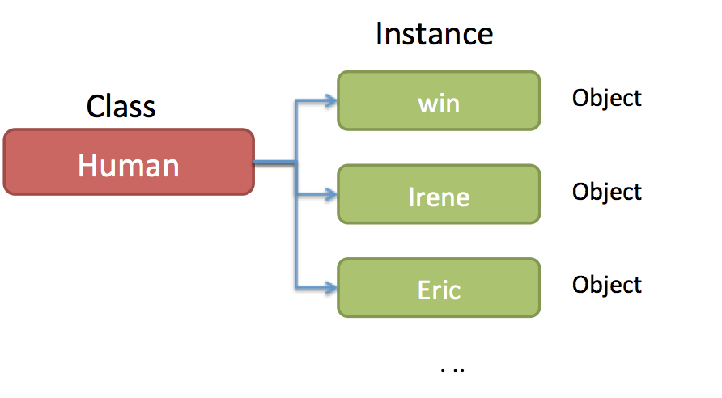
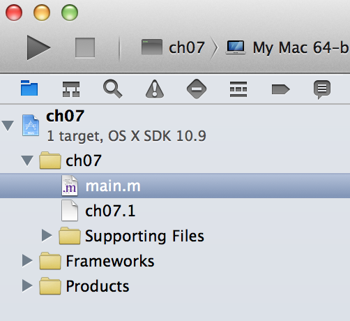
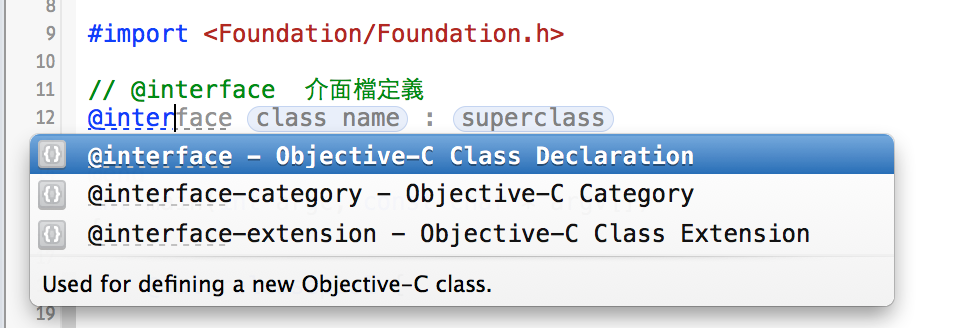
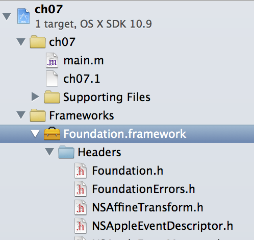
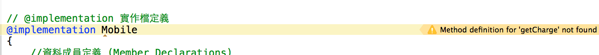
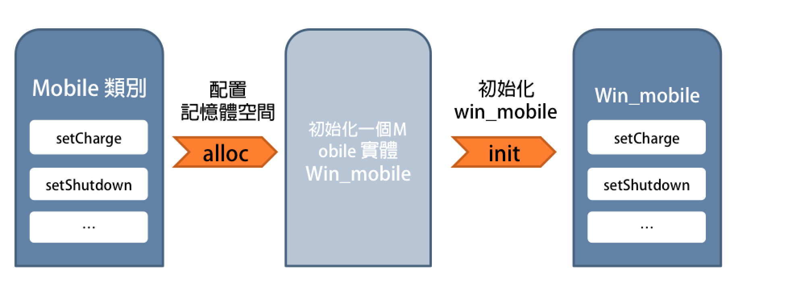
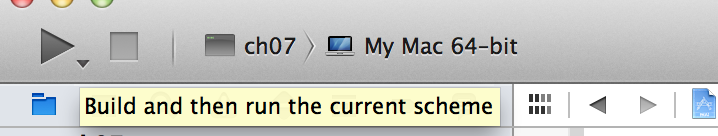
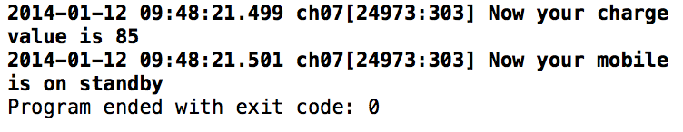
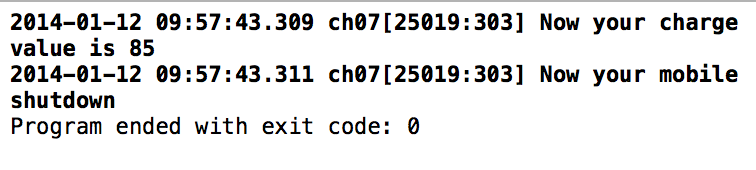
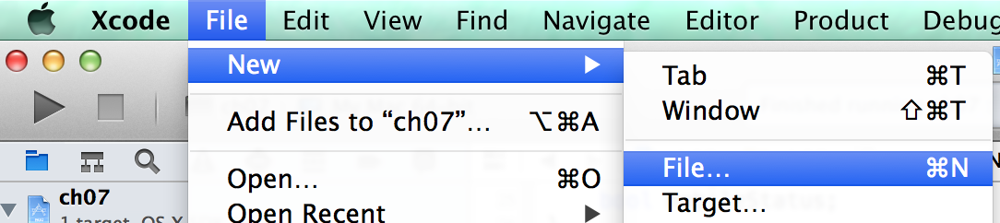

#Objective-C 程式設計學習筆記 Ch07

* Ch07-介紹 Objective-C 的類別。

其實這章不只講類別，還會提到物件導向的觀念，實體以及方法，以及會回到 ch01 所提及的 Objective-C 承襲 Smalltalk 的訊息傳遞模型 (message passing)，如何使用方法應用於類別與物件。下一章節是類別(2)。

物件其實是有點抽象複雜的概念，我的程度大概就只能表達到這樣的水平了，我一直不曉得到底該怎麼表達會比較好，希望大家多給些意見。


##目錄:
* (1) 什麼是類別
* (2) 實體 (Instance) 與方法 (Method)
* (3) 類別(class)的定義與實作
* (4) 存取實體變數與資料封裝


##(1) 什麼是類別
類別 (class) 是由實體變數跟可存取變數的方法 (method) 所組成，可以透過定義該類別，建立該類別的實體(Instance) 或物件 (Object)。

假如有個類別叫做 Human，我們可以說 win 是 Human 的實體 (Instance)，同理 Irene 以及 Eric 也是(此例人名僅是舉例)，每一個 Human 的實體 (Instance) 又稱為物件。


##(2) 實體 (Instance) 與方法 (Method)
類別或實體可以進行的行為，稱為方法 (Method)，方法有實體方法 (instance method) 也有類別 (class method) 方法。

| 方法名稱| 說明 |
|:----|:------|
| 類別方法  |  由類別所呼叫的方法，其方法的宣告前面都會加上 + 號。
| 實體方法 |  由類別的實體所觸發的方法。

比方說所有的 Human 的實體，都會走路 (walk), 喝水 (drink), 吃東西 (eat)，這些方法都稱為實體方法。

每個人被生下來的過程其實就是產生一個 Human 類別的實體，而該實體的性別會是女生 (becomeGirl) 還是男生 (becomeBoy)，這是類別方法。

---

### 如何呼叫方法

假設有個 Class 為 Mobile，Mobile 有幾個方法，比方說打電話 (call), 充電 (charge), 取得現在的電量 (getCharge) 都是。


如何呼叫方法，你可以之前學過其他語言呼叫方法的方式會是這樣子: `obj->method(argument);`。但在 Objective-C 中，做法不太一樣，假如有一個類別或實體要呼叫一個方法 (或者說傳遞訊息給類別或實體)，其語法如下:

```
[ClassOrInstance method];
```

左邊是類別或是實體的名稱(ClassOrInstance)，右邊為方法(method)的名稱。
另外，因為有些方法是可以傳遞參數的，因此語法也可以是這樣:

```
[ClassOrInstance method: argument];
```

要使用這些方法之前，必須要有一個物件作為對象，比方說我們先取得一隻手機 :
mobile 是 class(類別名稱)， 而 new 是類別方法，表示取得一支新的手機。

```
myMobile = [mobile new];
```

接下來我要讓 myMobile 做充電的動作，因此需要呼叫 charge 這個實體方法:

```
[myMobile charge]
```

由於 Objective-C 承襲 Smalltalk 的訊息傳遞模型 (message passing)，比較好一點的說法應該要說，發出一個 charge 的訊息給 myMobile 物件，charge 就是訊息 (message)，而 myMobile 就是訊息的接收者。myMobile 收到 charge 這個訊息之後，就看 charge 的這方法的內部如何定義實作。

接著，假如 charge 這個方法可以接受參數，該參數代表充電到幾 % 就結束充電，假設充電到 70% 就停止充電，其語法表示為:


```
[myMobile charge : 70];
```

假設我的朋友 Eric 也有一隻 Mobile，我們可以說 ericMobile 也是 Mobile 的實體 (instance)。

```
ericMobile = [Mobile new];
```
因此同樣都是 Mobile 的實體， Eric 的手機也具有相同的方法，像是打電話,充電等等。

```
[ericMobile charge];
```

===

###想想 Mobile 這個類別還有哪些方法?以及舉例使用方式

| 方法名稱| 說明 |
|:----|:------|
| [myMobile call : eric] |  myMobile 這的實體打電話給 Eric
| [myMobile charge : 100] | myMobile 充電到 100%
| [myMobile shutdown]| myMobile 關機
|...|...


---

### 實體/物件的狀態(state)
實體所呼叫的方法，可以改變物件的狀態，比方說目前手機的剩餘的電量就是一種狀態，如果使用 charge 方法，並且還有設定參數，比方說參數設為 100 ，`[myMobile charge : 100]`，就表示要將手機充電到 100%，當方法執行完成時，剩餘的電量狀態，也會被更變為 100。

另外手機目前是開機的，這也是一種狀態，當你傳遞(呼叫)關機的訊息(方法)時 `[myMobile shutdown]`，手機的狀態就會變成關機。


##(3) 類別(class)的定義與實作
* Objective-C 的類別必須定義介面（interface）與實作（implementation）兩個部分。
* 類別定義檔案的副檔名沿襲 C 語言的設計，介面檔 (interdace) 以 .h 為副檔名，實作檔案（implementation）以 .m 為副檔名。(在剛開始介紹時還不會介紹如何拆開介面檔與實作檔，會暫時先寫在同一支程式做介紹)。
* 以下範例，我們會來如何定義一個 Mobile 的類別 (Class)，分為以下幾個方面介紹:
	* interface 區塊
	* implementation 區塊
	* 使用/建立 Mobile 的實體(物件)
	* 利用 Xcode 建立 Mobile 的 Class	

---
在開始之前，請先使用 Xcode 建立一個新的 Project，我的 Project Name 取名為 ch07。
(如何建立可參考 Ch02 的做法，在此不再多做描述)。

建立好新的 Project 之後，點擊 main.m 檔案(接下來我們會覆蓋預設產生的 code):



---


### interface 區塊
編輯 main.m，首先 interface 介面檔的定義，格式如下:


```
// @interface  介面檔定義
@interface 類別名稱ClassName : superclass{
	//屬性(Property)或實體變數
}
//方法(Method)的宣告
@end
```

如果你沒有屬性/實體變數要宣告，可以省略大括號 { } :

```
// @interface  介面檔定義
@interface 類別名稱ClassName : superclass
	//方法(Method)的宣告
@end
```





> 當你鍵入 @inter 時，xcode 會幫你產生提示字元，只需要按 `tab` 鍵即可，會幫你補足順序第一位的提示文字(或是你有選擇其他的)，再接續按下一個 tab，則會跳到下一個提示字元(ex: @interface->(tab) class name -->(tab) superclass)

以下是目前的程式碼:

```
//
//  main.m
//  ch07
//
//  Created by win on 2014/1/9.
//  Copyright (c) 2014年 win. All rights reserved.
//

#import <Foundation/Foundation.h>

// @interface  介面檔定義
@interface Mobile : NSObject
    -(void) setCharge :(int) n;
    -(int) getCharge;
    -(void) setShutdown;
    -(void) print;
@end
```

我們定義了一個名為 Mobile 的類別 (Class)，`@interface Mobile: NSObject`，其 : 後面所接的 superclass，代表 Mobile 類別繼承哪一個 Class (繼承的詳細內容會在下章提到)。目前 Mobile 繼承 NSObject，我們可以說 Mobile 的父類別是 NSObject，而 NSObject 有一個子類別是 Mobile，繼承的部分在此先知道這樣就可以了。

至於你可能會疑惑為什麼我們可以在這裡用到 NSObject，這是因為我們已經 import Foundation 的檔案了，Foundation.h 已經有幫我們載入 NSObject 的介面檔了(NSObject.h)，你可以檢視 Foundation 的資料夾，就可以看到 Foundation 包含哪些介面檔。




接著我們在 @interface 區塊定義了我們這個類別所需要的實體方法。

```
    -(void) setCharge :(int) n;
    -(int)  getCharge;
    -(void) setShutdown;
    -(void) print;
```

* 各個方法的功能:
	* setCharge 決定充電量要到多少
	* getCharge 取得目前的充電量
	* setShutdown 讓手機關機
	* print 用來印出一些手機狀態的 NSLog


通常在方法的宣告前面，如果是『-』減號，代表該方法為`實體方法(instance method)`。而『＋』加號開頭的，代表該方法為`類別方法(class Method)`。因為我們的方法都是針對實體的行為，像是充電, 關機，透過實體方法改變實體的一些屬性等等，因此將這些方法定義為實體方法。類別方法是針對類別本身的行為，像是建立一個新的類別，暫時我們的範例還遇不到需要定義類別方法。

(void) 代表剛方法執行後的回傳值的形態，形態有很多種，void 只是其一，而 void 所指的就是『沒有回傳值』。

在 Objective-C 中，回傳一個值會用 `return 回傳值;`，如果沒有回傳值，你可以只寫 `return;` 即可。

假如今天我們宣告一個實體方法是需要回傳 int 型別的值，那麼你的宣告可能會是這樣:
`-(int) getCharge;` ，也就是 getCharge 這個方法必須回傳一個 int 的數字。


接下來，我們要為我們所宣告的實體方法做一些改變，目前的實體方法，可以有一些改變，比方說充電，我們可以決定只要充電到多少 % 就可以停止，因此我們可以為我們所定義的方法，增加參數，而充電要充到多少 % ，這個數值就是該方法的參數。


####帶有參數的方法可以這樣定義:

```
-(void) setCharge: (int) n;
```

此圖比對定義實體方法有無參數的差別: 


現在我們已經將 setCharge 這個實體方法定義為，沒有回傳值(-(void))，而且可以接受一組 int 型別的參數(:(int) n)，該參數名稱定義為 n (n是我們自己定義的，你也可以取其他的名字)，而且 n 這個參數可以被 setCharge 這個方法所使用。

#### 你可能會問，只能有一個參數嗎？

其實不然，參數可以不只有一個，假設今天有個日期的類別，其中有個方法要你設定一段日期的期間，那個就需要兩個參數，一個是起始日期，另一個是結束日期，你的實體方法可能會是這樣:

```
-(void) dateFrom: (int) n dateTo: (int) m;
```
口語上你可以說這是一個 dateFrom:dateTo: 方法。

interface 的介紹就先到這個部分，以下是目前 main.m 的完整版本，寫完介面檔之後，接下來就是要來定義這些方法如何實作，也就是進到下一個階段，implementation 實作檔階段。


main.m 檔:

```
//
//  main.m
//  ch07
//
//  Created by win on 2014/1/9.
//  Copyright (c) 2014年 win. All rights reserved.
//

#import <Foundation/Foundation.h>

// @interface  介面檔定義
@interface Mobile : NSObject
    -(void) setCharge :(int) n;
    -(int)  getCharge;
    -(void) setShutdown;
    -(void) print;
@end
```


### implementation 區塊
撰寫 implementation 實作檔，必須要實作或定義你在介面檔所宣告的方法，在實作檔中，也會定義這個類別有哪些變數或是資料成員，這些變數就是實體變數(instance variable)。講直接一點就是，在 interface 介面檔你會定義你需要哪些方法，至於這些方法怎麼做事情，是寫在實作檔。

```
// @implementation 實作檔定義
@implementation className
{
    //資料成員定義 (Member Declarations)
}

//實作定義在 interface 區塊的方法 (methods)

@end
```

實作檔的定義一樣要給類別名稱 (className)(ex:`@implementation Mobile`)，這裡的類別名稱要跟 interface 介面檔的一樣。

>順帶一提，如果你的 implementation 實作檔如果少寫了 interface 所定義的方法，是會被警告的，你會得到 `Method definition for 實體方法名稱 not found` 的訊息。



什麼是資料成員？其實就是實體變數，比方說充電量的值，會隨著 call 方法是否被呼叫而改變，這也算是一種資料成員，與該實體有關，能夠被存取,改變狀態的資料。

定義資料成員會被 { } 大括號所包覆，在這個 { } 裡所定義的變數就是實體變數，當你建立一個新的實體時，該實體的實體變數也會被建立。假設我們有個實體變數稱為 chargeValue，表示現在的充電量，如果有個新的實體稱為 win1mobile，有另一個實體稱為 win2modile，那麼 win1mobile 與 win2mobile 都會有各自的 chargeValue。


在 implementation 實作檔中方法(method)的定義，跟 interface 宣告實體變數跟方法的方式很像，一樣是先用『+』,『-』加號或減號宣告是類別方法還是實體方法，接下來使用 ( ) 小括弧宣告方法的回傳值的型別，然後接上方法名稱，若該方法有帶參數的話，一樣是需要使用 `:(參數型別) 參數名稱`，接著宣告的程式內容，{ } 左右括號內的程式就是實作該方法的程式。

####以下是我們為 Mobile 這個類別 (class) 所寫的 implementation，不要衝動，看完再說 :

```
// @implementation 實作檔定義
@implementation Mobile
{
    //資料成員定義 (Member Declarations)
    int chargeValue;
    bool mobileStatus;
}
-(void) setCharge :(int) n{
    chargeValue = n;
}
-(int) getCharge{
    return chargeValue;
}
-(void) setShutdown{
    mobileStatus = 1;
}
-(void) print{
    NSLog(@"Now your charge value is %i", chargeValue);

    if(mobileStatus==1){
      NSLog(@"Now your mobile shutdown");
    }else{
      NSLog(@"Now your mobile is on standby");
    }
}
@end

```

Mobile 這個類別的實作檔有兩個實體變數，分別是 chargeValue 以及 mobileStatus，chargeValue 用來儲存充電量的值，而 mobileStatus 型別是布林值(Bool)，這個值用來儲存 Mobile 開/關機的狀態，因為開關這種狀態只有正反兩面的值，不是有就是沒有，因此宣告為布林值得形態。


接著是好幾個方法的宣告，方法的前面使用 『-』 減號，因為這些方法屬於實體方法。

* setCharge 方法可以帶一個 int 型別的參數，此方法的內部實作就是將 chargeValue 的值改變為你所輸入的參數值。
* getCharge 方法可以用來取得 chargeValue 的值(return chargeValue)。
* setShutdown 方法可以改變 mobileStatus 的值，1 則為是/開機/YES。
* print 方法用來 NSLog 出 chargeValue 以及 mobileStatus。

萬事俱備了，下一段教你怎麼用 Mobile 類別，如何產生一個 Mobile 的實體(物件)，並且使用實體的方法。 
以下是目前完整的 main.m 檔:

```

#import <Foundation/Foundation.h>

// @interface  介面檔定義
@interface Mobile : NSObject
    -(void) setCharge :(int) n;
    -(int)  getCharge;
    -(void) setShutdown;
    -(void) print;
@end


// @implementation 實作檔定義
@implementation Mobile
{
    //資料成員定義 (Member Declarations)
    int chargeValue;
    bool mobileStatus;
}
-(void) setCharge :(int) n{
    chargeValue = n;
}
-(int) getCharge{
    return chargeValue;
}
-(void) setShutdown{
    mobileStatus = 1;
}
-(void) print{
    NSLog(@"Now your charge value is %i", chargeValue);

    if(mobileStatus==1){
      NSLog(@"Now your mobile shutdown");
    }else{
      NSLog(@"Now your mobile is on standby");
    }
}
@end

```


### 使用/建立 Mobile 的實體(物件)
我們繼續編輯 main.m，接下來我們會在 main 這個 function 寫我們的程式:

```
int main(int argc, const char * argv[])
{

    @autoreleasepool {
        Mobile *win_mobile =[[Mobile alloc] init];
        [win_mobile setCharge:85];
        [win_mobile print];
    }
    return 0;
}
```

####(1)建立記憶體空間 (alloc) 與初始化 (init)
我們在 main 函式定義一個 win_mobile 的變數，而 win_mobile 就是 Mobile 的實體。

Mobile \*win_mobile 是建立一個名為 win_mobile 的 Mobile 物件(實體)。\* 表示該物件變數為一個指標 (pointer)。指標只儲存該物件的記憶體位置而不是物件本身。

宣告一個物件為指標只是指向一個記憶體位置，但不會自動初始化這個物件(實體)，你會發現 Mobile \*win_mobile 中間沒有任何等號 (=)，他跟一般變數的指派運算子不一樣，用\*來表示右邊的物件是建立的來源，如果你沒有指定 * 後面的物件，指標會不知道要指向給誰。

[Mobile alloc] 代表傳遞 alloc 這個訊息給 Mobile 這個類別，產生一個 Mobile 的實體並且分配記憶體空間給 win_mobile，alloc 這個方法重點在於分配記憶體空間。


除了要使用 alloc 分配記憶體空間之外，還要初始化 (init) 這個實體，所以必須要使用 init 這個方法，這樣你才有辦法正常的使用這個 win_mobile 實體。

>alloc 是 allocate 的縮寫，英文為分配的意思。


```
Mobile *win_mobile =[[Mobile alloc] init];
```



其實上面這段程式也相當於這三段程式: (或許這樣看會比較好理解)

```
//將 win_mobile 變數的位置指定給 Mobile
win_mobile *Mobile;
//分配記憶體空間
win_mobile = [Mobile alloc];
//初始化 win_mobile 的實體
win_mobile = [Mobile init];
```

##### 我們沒有宣告 alloc 以及 init 方法，為什麼有這兩個方法可以使用？
因為 Mobile 的 superClass(父類別) 是 NSObject，因此 alloc 以及 init 這兩個方法是繼承字 NSObject，我們會在後面繼承的章節再次遇到。

> \* 星號是一種有特殊意義的符號，在 Objective-C 中稱為指標 (pointer)，指標是用來參考(reference) 其他物件或資料形態的值。

> 指標(Pointer)與地址(Address)的觀念:
> 我們可以宣告一個變數，該變數存的值是一個記憶體的位置，用 \* 號表示，宣告指標變數時會這樣表示 : `TypeNname *pointer;` ，像是 win_mobile *Mobile 就是 win_mobile 這個變數儲存的值是 Mobile 類別的記憶體位置，我們也可以說 win_mobile 是一個指標變數。指標會在後面章節會再遇到，在此先知道這樣就可以了。


> 還有一種運算子叫做取址運算子(&)，用來取得一個變數的記憶體位置。

####(2)還記得 Objective-C 是如何呼叫方法的嗎?

```
[receiver message]
```
左邊是訊息的接收者，右邊是傳遞給接收者的訊息。

因此我們想要傳遞 setCharge 這個訊息 (方法) 給 win_mobile 這個實體，就會這樣表示:
另外，之所以可以傳遞參數 85 這個數值，也是因為我們在 interface 以及 implementation 有宣告此方法可以帶一個 int 型別的參數。

```
[win_mobile setCharge:85];
```

同樣的，如果要傳遞其他方法也是一樣 :

```
[win_mobile print];
```

我們 build 一下現在的程式，看看會有什麼結果，點按 xcode 左上角的 build 按鈕:




以下是執行結果的 Log:
我們可以看到第一行 Now yoy charge value is 85，這句 NSLog 是經由 print 方法所實踐的，而因為我們在 print 方法之前有先呼叫 `[win_mobile setCharge:85];` ，因此我們已經改變了 chargeValue 的值。

第二行 Log : Now your mobile is on standby，顯示現在手機的開關機狀態，因為我沒有呼叫 setShutdown 方法，因此還是待機狀態。



我們來呼叫一下 setShutdown 方法，如此一來 Log 的結果就會不一樣了 :

```
Mobile *win_mobile =[[Mobile alloc] init];
[win_mobile setCharge:85];
[win_mobile setShutdown];
[win_mobile print];
```

Log 結果:



---


以下是目前 main.m 的完整程式碼，通常我們不會把一個類別的 interface 以及  implementation 以及使用它的程式寫在同一隻檔案，下一段教你如何建立 class 類別檔，拆分為 .h 檔以及 .m 檔。

```
//
//  main.m
//  ch07
//
//  Created by win on 2014/1/9.
//  Copyright (c) 2014年 win. All rights reserved.
//

#import <Foundation/Foundation.h>

// @interface  介面檔定義
@interface Mobile : NSObject
    -(void) setCharge :(int) n;
    -(int)  getCharge;
    -(void) setShutdown;
    -(void) print;
@end


// @implementation 實作檔定義
@implementation Mobile
{
    //資料成員定義 (Member Declarations)
    int chargeValue;
    bool mobileStatus;
}
-(void) setCharge :(int) n{
    chargeValue = n;
}
-(int) getCharge{
    return chargeValue;
}
-(void) setShutdown{
    mobileStatus = 1;
}
-(void) print{
    NSLog(@"Now your charge value is %i", chargeValue);

    if(mobileStatus==1){
      NSLog(@"Now your mobile shutdown");
    }else{
      NSLog(@"Now your mobile is on standby");
    }
}
@end


int main(int argc, const char * argv[])
{

    @autoreleasepool {
        Mobile *win_mobile =[[Mobile alloc] init];
        [win_mobile setCharge:85];
        [win_mobile setShutdown];
        [win_mobile print];
    }
    return 0;
}

```


### 利用 Xcode 建立 Mobile 的 Class

這個階段，我們要把寫在 main.m 檔的 Mobile 類別製作成類別檔。

* 第一步，選擇 『File』->『New』->『File...』
	
	
* 第二步，選擇 Objective-C class，然後點選『Next』。
	
	
* 第三步，輸入你要建立的類別(class)名稱，輸入 Mobile，接著點按 『Next』。 
	
	
* 第四步，選擇檔案儲存的路徑，通常我是按照預設的位置(project的資料夾底下)。 
	
	
* 完成後，你會看到你的目錄已經出現 mobile.h 以及 mobile.m 檔。
	
	
	
#### 編輯 mobile.h
把剛剛寫在main.m 的 interface 區段移到 mobile.h。
以下是 mobile.h:

```
//
//  Mobile.h
//  ch07
//
//  Created by win on 2014/1/12.
//  Copyright (c) 2014年 win. All rights reserved.
//

#import <Foundation/Foundation.h>

@interface Mobile : NSObject
-(void) setCharge :(int) n;
-(int)  getCharge;
-(void) setShutdown;
-(void) print;
@end
```


####編輯 mobile.m
把剛剛寫在 main.m 的 implement 區段移到 mobile.m。
以下是 mobile.m:

```
//
//  Mobile.m
//  ch07
//
//  Created by win on 2014/1/12.
//  Copyright (c) 2014年 win. All rights reserved.
//

#import "Mobile.h"

@implementation Mobile
{
    //資料成員定義 (Member Declarations)
    int chargeValue;
    bool mobileStatus;
}
-(void) setCharge :(int) n{
    chargeValue = n;
}
-(int) getCharge{
    return chargeValue;
}
-(void) setShutdown{
    mobileStatus = 1;
}
-(void) print{
    NSLog(@"Now your charge value is %i", chargeValue);
    
    if(mobileStatus==1){
        NSLog(@"Now your mobile shutdown");
    }else{
        NSLog(@"Now your mobile is on standby");
    }
}

@end
```
#### 編輯 main.m
既然剛剛把 mobile 的 interface 以及 implenemt 都搬到 mobile.h 以及 mobile.m 了，現在 main.m :


不過現在 main.m 出了一點問題，因為他不知道 win_mobile 要初始化的類別 Mobile 是誰，因為我們少了 import Mobile 這個類別（class），因此我們要在 #import <Foundation/Foundation.h> 下面多 #import ”mobile” 的 interface (介面檔)。

修改後的 main.m:

```
//
//  main.m
//  ch07
//
//  Created by win on 2014/1/9.
//  Copyright (c) 2014年 win. All rights reserved.
//

#import <Foundation/Foundation.h>
#import "Mobile.h"

int main(int argc, const char * argv[])
{

    @autoreleasepool {
        Mobile *win_mobile =[[Mobile alloc] init];
        [win_mobile setCharge:85];
        [win_mobile setShutdown];
        [win_mobile print];
    }
    return 0;
}


```

>為什麼引入 Foundation 是這樣寫 #import <Foundation/Foundation.h> ，而引入 Mobile.h 卻是要用雙引號刮起來(#import "Mobile.h")？會有這樣的差別是因為 Foundation 是系統檔案，而 Mobile 類別是你自己客製化產生的類別 (class)。

	
	
##(4) 存取實體變數與資料封裝
每個實體/物件都可以存取自己的實體變數，但是類別方法不能夠『直接』存取實體變數，因為類別方法沒有辦法處理自己產生的實體/物件，類別方法只能用在類別本身。

基本上每個實體內的資料都是私有的，你可以當作在 implementation 宣告的變數都是私有變數:

```
@implementation ClassName {
  int memberVar3; //私有實體變數
}
```

也正因為類別方法不能直接存取實體變數，因此會有一些實體方法提供取得實體變數的方法出來，比方說 getCharge 方法就是一種 getter，setCharge 就是一種 setter，你會常常在實體方法的宣告中看到用 set 開頭或是 get 開頭的方法，不論是 setter 或是 getter 這些都是 Accessor method (有些書會翻譯為『存取器』或『存取方法』) 。然而 `setter 方法通常是用來設定或改變某些實體變數的方法`，因此 setter 通常不會需要回傳值，因為他的角色是用來改變某些值; 而 `getter 用來取值`，因此 getter 是需要有回傳值的。

###為什麼需要製作這些 getter 跟 setter 方法？
這是因為你無法從類別以外取得/改變實體變數的值，因此可以透過 setter 與 getter 讓外界取得/改變某些實體變數的值，這就是資料封裝的概念。(有一些文章有寫道其實 getter 與 setter 就是提供獲得實體對象屬性值的API。)

>資料封裝的英文為 Data Encapsulation，這個字源自於英文的『capsule』的膠囊，你只需要知道某顆膠囊的功能跟服用方式，可是你不用知道膠囊是如何製作的。因此封裝的概念其實就是資訊隱藏，將資料 (屬性) 與方法 (method) 封裝在物件/實體中，而提供訊息傳遞的方法就是 getter 與 setter。

###好物 @property 以及 @synthesize 
如果你覺得總是要自己寫存取某些實體變數的 getter 與 setter 很麻煩，那麼下章節會介紹到 Objective-C 提供的合成存取方法，利用 @synthesize 自動產生 getter 與 setter。

---

#### 下一章節，將會介紹 Objective-C 類別(2) 。
類別(2) 會介紹如何傳遞參數到方法, static 與 self 關鍵字, 合成存取方法(@synthesize)等等。


---

<a rel="license" href="http://creativecommons.org/licenses/by-nc-sa/4.0/"></a><br />本著作由<span xmlns:cc="http://creativecommons.org/ns#" property="cc:attributionName">WinWu</span>製作，以<a rel="license" href="http://creativecommons.org/licenses/by-nc-sa/4.0/">創用CC 姓名標示-非商業性-相同方式分享 4.0 國際 授權條款</a>釋出。