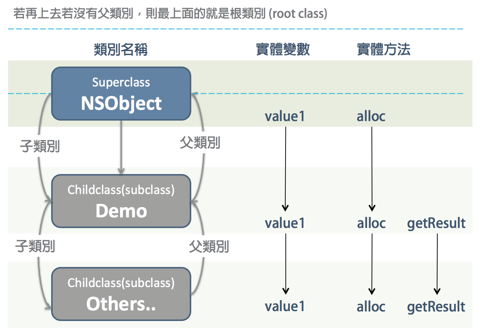
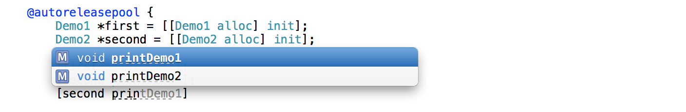

#Objective-C 程式設計學習筆記 Ch09

* Ch09-介紹 Objective-C 的繼承。

##目錄:
* (1) 什麼是繼承 (inheriance)
* (2) override 覆蓋
* (3) super 關鍵字
* (4) 抽象類別 (Abstract classes)


##(1) 什麼是繼承 (inheriance)
什麼是繼承 (inheriance)， 我大概分以下幾個方向去描述:

* 什麼是繼承？
* 繼承可以得到什麼？

恩還記得前幾個章節我們所寫的幾乎每一個類別，都是繼承自 NSObject 嗎？ 複習一下 interface 界面檔的宣告方式:

```
// @interface  介面檔定義
@interface 類別名稱ClassName : superclass
	//方法(Method)的宣告
@end
```

假如有個 Demo 類別的 superclass 是 NSObject，那我們就可以說 Demo 的父類別是 NSObject，而 NSObject 也有一個子類別是 Demo:

```
@interface Demo : NSObject{
    //....
}
@end

```

> 你可能為覺得好奇的是，為什麼總是繼承 NSObject? 這是因為在 Objective-C 中的根類別 (root class) 就是 NSObject 類別，除了它以外，其他所有的類別都有父類別 (可以說 NSObject 沒有父類別)。

因此 Demo 類別已經繼承 NSObject 了，再回到之前我們是如何建立個實體的，例如 :

```
Demo *test = [[Demo alloc] init];
```
假設我們並沒有在 Demo 類別宣告 alloc 以及 init 的方法，為何 Demo 可以使用這兩個方法？這原因就是因為 Demo 類別繼承 NSObject，繼承有個特性，`子類別可以繼承父類別的所有實體方法跟變數`。

---

###以下這張圖用來解釋繼承的關係:
當 Demo 繼承自 NSObject，也表示繼承了 NSObject 的實體方法跟實體變數，因此當我們要使用 Demo 建立一個物件時，直接使用的 alloc 或 init 都是繼承自 NSObject。(此圖只是舉例，實際上 NSObject 當然不可能只有這些實體變數跟方法)。

而若有新的類別繼承字 Demo 類別，那麼他一樣能夠使用 Demo 類別的實體變數跟方法 (ex: getResult)。



繼承就是建立一個新類別來 (1)擴充 或 (2)修訂原類別(父類別) 或 (3)直接使用父類的實體變數與方法 的功能，修訂其實就是我們接下來會講的複寫 override。

> objective-C 沒有多重繼承，一個類別只能有一個父類別。 


---

###一個練習: 
####現在我們來寫兩個 class，其中第二個 class 必須繼承第一個 Class，第一個又必須繼承 NSObject，並且試著呼叫父類的方法以及實體變數。

```
//這是第一個 class Demo1,  繼承 NSObject
@interface Demo1 : NSObject
-(void) printDemo1;
@end

@implementation Demo1
-(void) printDemo1{
    NSLog(@"Hi i am Demo1");
}
@end

//這是第二的 class Demo2, 繼承 Demo1
@interface Demo2 : Demo1
-(void) printDemo2;
@end

@implementation Demo2
-(void) printDemo2{
    NSLog(@"Hi i am Demo2");
}
@end

```

程式部分:

```
Demo1 *first = [[Demo1 alloc] init];
Demo2 *second = [[Demo2 alloc] init];
        
[first printDemo1];
[second printDemo1]; //second 可以呼叫父類別 Demo1 的實體方法
[second printDemo2]; 
```

執行結果:

```
2014-01-18 11:53:53.470 ch07[7366:303] Hi i am Demo1
2014-01-18 11:53:53.472 ch07[7366:303] Hi i am Demo1
2014-01-18 11:53:53.472 ch07[7366:303] Hi i am Demo2
```

* 甚至你在輸入 second 的方法字頭 prin 時，Xcode 的提示字元也會出現父類是 prin 開頭的方法:



---

##(2) override 覆蓋

覆蓋其實就是寫一個跟父類同名方法，子類別的方法會取代父類別的方法，這就是 override。被覆蓋的方法就不會再繼承父類的方法了，但其他沒有被覆蓋的方法一樣是具有繼承的特性。

>我們無法透過繼承刪除/修改父類的實體方法，因此想要改變繼承而來的方法其內部實作如何，就使用 override 吧。

覆蓋沒有什麼特別的關鍵字，只要該類別的:

1. 實體方法命名與想要覆蓋的父類方法同名即可。
2. 該方法的回傳形態跟參數形態要一樣。


####我們來改一下上一段 Demo1 與 Demo2 類別的範例，讓 Demo2 新增一個方法來 override Demo1 類別的 printDemo1 的方法:

```
//這是第一個 class Demo1,  繼承 NSObject
@interface Demo1 : NSObject
-(void) printDemo1;
@end

@implementation Demo1
-(void) printDemo1{
    NSLog(@"Hi i am Demo1");
}
@end

//這是第二的 class Demo2, 繼承 Demo1
@interface Demo2 : Demo1
-(void) printDemo2;
-(void) printDemo1;
@end

@implementation Demo2
-(void) printDemo2{
    NSLog(@"Hi i am Demo2");
}
//覆寫 override Demo1 類別的 printDemo1 方法
-(void) printDemo1{
    NSLog(@"Haha! i override you ;)");
}
@end

```


#####程式部分:
```
Demo1 *first = [[Demo1 alloc] init];
Demo2 *second = [[Demo2 alloc] init];
        
[first printDemo1];
[second printDemo1];
[second printDemo2];
```

#####執行結果:

```
2014-01-19 11:48:01.631 ch07[9839:303] Hi i am Demo1
2014-01-19 11:48:01.632 ch07[9839:303] Haha! i override you ;)
2014-01-19 11:48:01.633 ch07[9839:303] Hi i am Demo2
```


##(3) super 關鍵字
還記得我們上一章 ch08 有學過一個 self 關鍵字，self 用在一個方法裡面要呼叫另外一個方法。現在要介紹的這個 `super 關鍵字，用在一個方法裡面要呼叫父類別的方法`。

沒錯，我們現在又要來改 Demo1 以及 Demo2 類別 :P，改成當使用 printDemo2 的方法時也會呼叫 Demo2 父類別(也就是 Demo1) 的 printDemo1 方法 `[super printDemo1]`：

```
//這是第一個 class Demo1,  繼承 NSObject
@interface Demo1 : NSObject
-(void) printDemo1;
@end

@implementation Demo1
-(void) printDemo1{
    NSLog(@"Hi i am Demo1");
}
@end

//這是第二的 class Demo2, 繼承 Demo1
@interface Demo2 : Demo1
-(void) printDemo2;
@end

@implementation Demo2
-(void) printDemo2{
    //在 printDemo2 內部呼叫父類別(Demo1) 的方法 printDemo1
    [super printDemo1];
    NSLog(@"Hi i am Demo2");
}
@end
```

程式部分:

```
Demo2 *second = [[Demo2 alloc] init];
[second printDemo2];
```

執行結果:

```
2014-01-19 12:21:32.551 ch07[10030:303] Hi i am Demo1
2014-01-19 12:21:32.553 ch07[10030:303] Hi i am Demo2
```

---


##(4) 抽象類別 (Abstract classes)
抽象類別 (Abstract classes) 又稱為抽象超類別 (Abstract superclasses)，至於為什麼叫做 Abstract superclasses，是因為 abstract classes 只是用來更方便地產生一個子類別而存在的類別，實際的實作功能是必須要由 subclass(子類別) 來完成的，因此 abstract classes 也被稱為 abstract superclasses，NSObject 就是一個例子。


* 此段可以看精通 Objective-C 程式設計(第五版), P176
* 參考 : [The Objective-C Programming Guide 入門筆記 2011/07/12  Written by Shuho Chou](http://rintarou.dyndns.org/2011/07/12/the-objective-c-programming-guide-%E5%85%A5%E9%96%80%E7%AD%86%E8%A8%98/)


---

#### 下一章節，將會介紹 Objective-C 同名異式 (Polymorphism)。

---

<a rel="license" href="http://creativecommons.org/licenses/by-nc-sa/4.0/"></a><br />本著作由<span xmlns:cc="http://creativecommons.org/ns#" property="cc:attributionName">WinWu</span>製作，以<a rel="license" href="http://creativecommons.org/licenses/by-nc-sa/4.0/">創用CC 姓名標示-非商業性-相同方式分享 4.0 國際 授權條款</a>釋出。