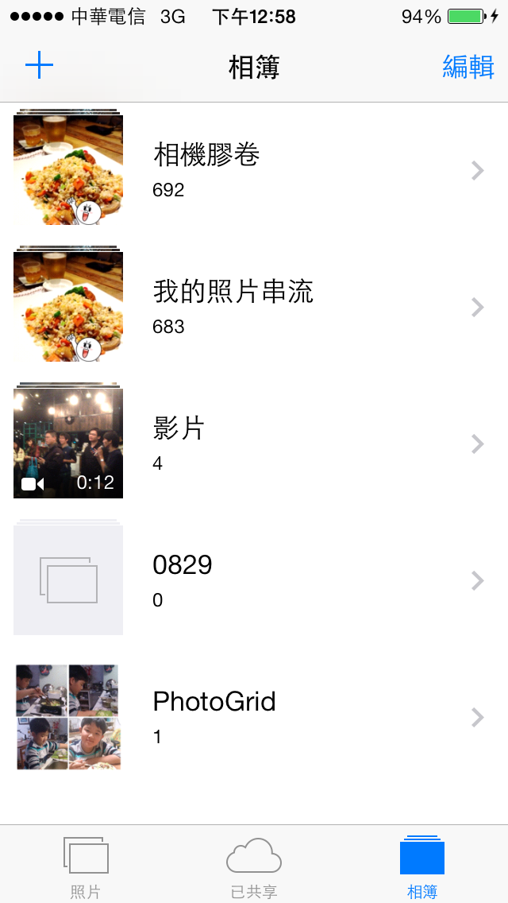
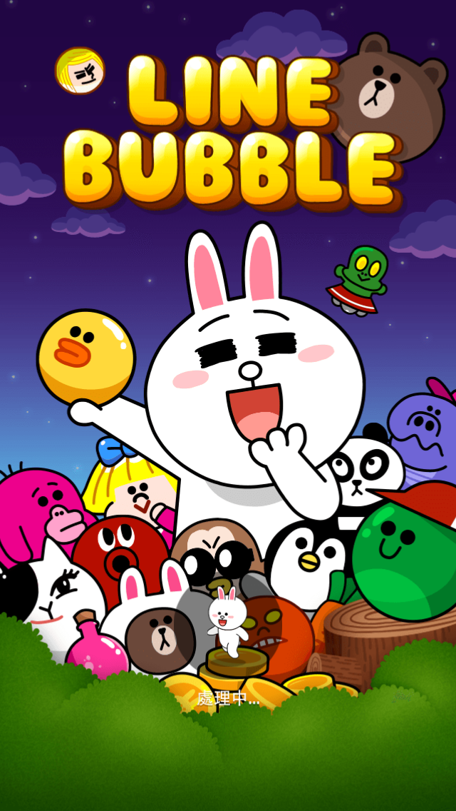
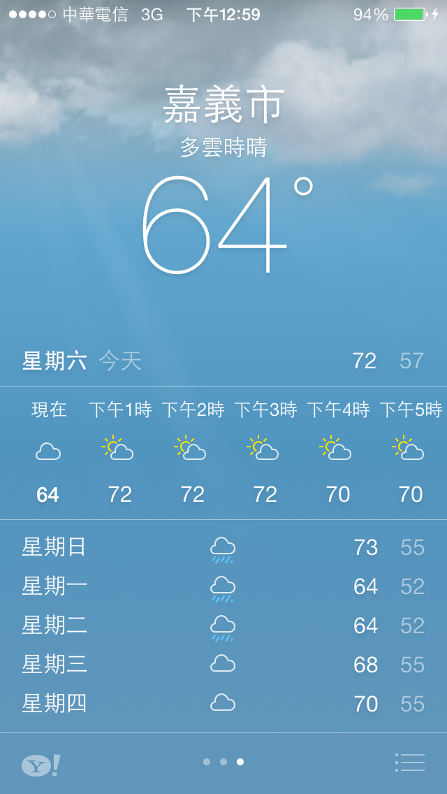
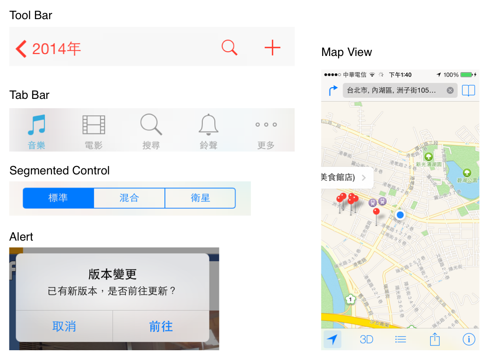

layout: post
title: "title: [深入淺出 iPhone 與 iPad 開發(第二版)] Ch02 筆記"
date: 2014-02-08 12:24:00
description: ""
catrgories: learning
tags : [Objective-C]

---

#Ch02 - IOS 應用程式設計模式

這篇筆記除了是 Head First 第二章的心得之外，還包含一些延伸的學習筆記。

* Q: 如何規劃你的應用程式配置? 
* A: 一切從草圖開始 -> 建立 GUI -> 規劃如何使用畫面的控制項 -> 處理資料。
* 使用性跟美感是 iPhone 的成功關鍵。

## IOS HIG 應用程式設計規則
> ios Human Interface Guide (HIG，人機介面指南)

* Apple 公司有發佈一份文件作為指導如何開發要在 App Store 要賣的 APP，當你要準備送審 APP 時，你必須同意你的 APP 符合 HIG 規範。

### HIG 的三種類型
HIG 有三種應用程式的開發類型，用以符合不同需求的應用程式，這三種分別是:

####1. 生產力應用程式 (Productivity App)
* 顯示方式偏好管理介面，階層式架構的資訊顯示方式。 

####2. 融入式應用程式 (Immersive App)
* 比較自由的 GUI 介面，HIG 對這類 App 的審核比較寬鬆，最好的例子是遊戲。 
	 	
####3. 工具應用程式 (Utility App)
*  盡可能少提供設定的功能給使用者，通常是提供特定資訊而已。通常這類的 App 會比較嚴格的要求符合 HIG。 

---

因為現在已經到了 IOS7 了，歡迎參考最新的文章 : [iOS 7 Design Resources   iOS Human Interface Guidelines](https://developer.apple.com/library/ios/documentation/userexperience/conceptual/mobilehig/)

##關於 IOS7 的設計
### IOS7 介面的解剖
* 幾乎所有的 App 都會需要使用 UIKit Framework 來定義畫面的 UI 組件，了解各個組件的名稱, 角色, 以及功能為何有助於節省開發 App 的時間。

舉例來說，以下是一些常見的 UI 元件 (個人覺得，了解各個組件的名稱與定義也能減少團隊開發之間溝通的障礙，不過如果 co-worker 都是有經驗的老手，應該會很少有這樣的問題 :P )：( 參考 [Apple Developer 的說明文件之圖](https://developer.apple.com/library/ios/documentation/userexperience/conceptual/mobilehig/Art/uikit_ui_elements_2x.png)。)

### UIKit 提供的 UI 元素可分為四大類
* 分別是 Bars, Content Views, Controls, Temporary views, 通常建議記住英文名詞。
* 我必須說這一定不會是最新版的情況， Apple 的版本會不斷的更新。

| UI 元素 | 中文名詞 | 解釋 | 常見 UI 種類
|:-----------|:------------|:------------|:--- |
| Bars       |  欄 |    Bars 用來讓使用者瀏覽或操作該 App 的上下文訊息。| Status Bar(狀態欄), Navigation Bar(導航欄), ToolBar(工具欄), Tab Bar(標簽欄)   
| Content Views    |   內容視圖 |  Content views 呈現該 App 特定的內容，而且也可以包含一些行為，像是 scrolling(滾動), insertion(插入/新增), deletion, 以及資料的安排方式。 | Map View, Image View, Collection View, Scroll View, Table View. 
| Controls       |     控制器 |    Controls 用來呈現資訊跟設定的動作。 | Page View Controller.   
| Temporary views| 臨時視圖 |     臨時視圖顯示短暫的重要信息或額外的選擇和功能給用戶。     

* 因為 UI 的部分是很龐大的內容，在此章不再多介紹摟，再寫下去就離題了 XD
* 你需要了解各種標準控制項的適當使用時機，建構視圖之前可以先參考 Apple 提供的 iOS UI Element Usage Guideline。

##參考:
* [[ISUX转译]iOS7人机界面指南-UI元素(上)](http://isux.tencent.com/ios-human-interface-guidelines-ui-design-ios7-ui-1.html)